# 📝📅 React ToDo Pro: Modern Task Manager 🇬🇧
_A modern, stylish React web application for managing, sorting, and analyzing your daily tasks, with a beautiful blue-white-black theme and Unsplash background._

[](https://opensource.org/licenses/MIT)
[](https://reactjs.org/)
[]()
[](https://unsplash.com/)


## 📋 Table of Contents
1. [Overview](#-overview)
2. [Key Features](#-key-features)
3. [Screenshots (Conceptual)](#-screenshots-conceptual)
4. [System Requirements](#-system-requirements)
5. [Installation and Setup](#️-installation-and-setup)
6. [Application Usage](#️-application-usage)
7. [File Structure (Expected)](#-file-structure-expected)
8. [Technical Notes](#-technical-notes)
9. [Contributing](#-contributing)
10. [License](#-license)
11. [Contact](#-contact)

## 📄 Overview

**React ToDo Pro** is a modern, stylish web application built with React for managing your daily tasks. It features a beautiful blue-white-black theme, Unsplash background, and advanced task management: priorities, sorting, filtering, and more. The app is fully responsive and stores your data in the browser (localStorage).

<br>
<p align="center">
  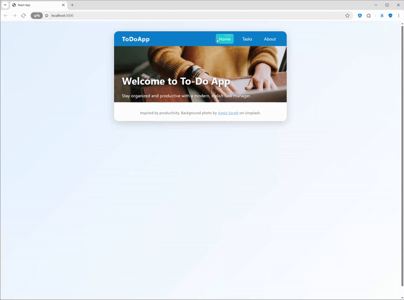
</p>
<br>

## ✨ Key Features

*   🗂️ **Navigation Menu**: Home, Tasks, About
*   ➕ **Add, Edit, Delete Tasks**: Manage your to-dos with ease
*   ⭐ **Task Priorities**: High, Medium, Low
*   🔍 **Sorting & Filtering**: By priority, status, or alphabetically
*   📊 **Task Counter**: See how many tasks are done and left
*   🧹 **Clear Completed**: Remove all completed tasks with one click
*   ⚠️ **Confirmation Dialogs**: For deleting and clearing tasks
*   🎨 **Modern UI**: Blue-white-black theme, Unsplash background, responsive design
*   💾 **Data Persistence**: Tasks are saved in your browser (localStorage)
*   🏷️ **About Section**: Info about the app and author
*   🌀 **Animations**: Smooth transitions for adding/removing tasks

## 🖼️ Screenshots (Conceptual)

_Screenshots of: the main app view, navigation menu, task list with priorities, and about section._

<p align="center">
  
  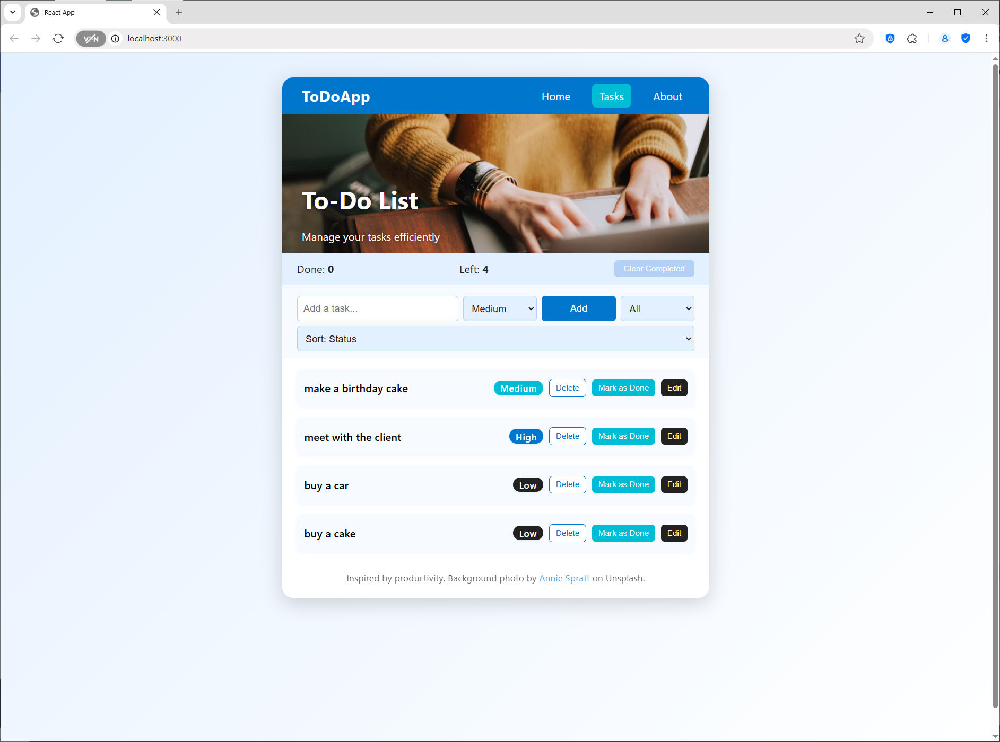
  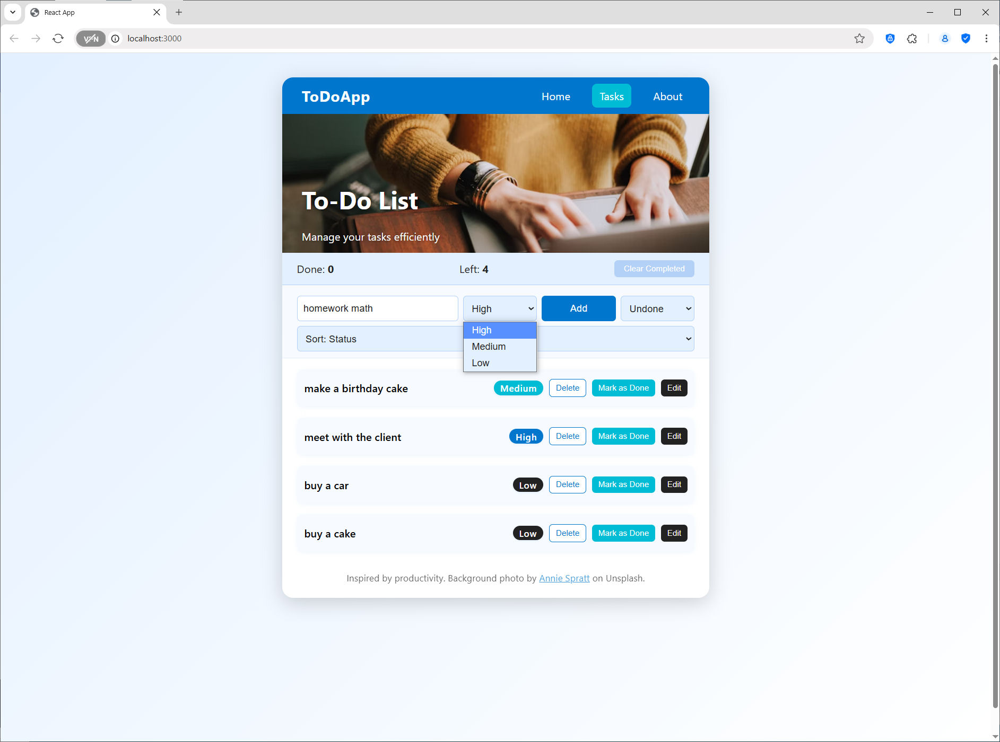
  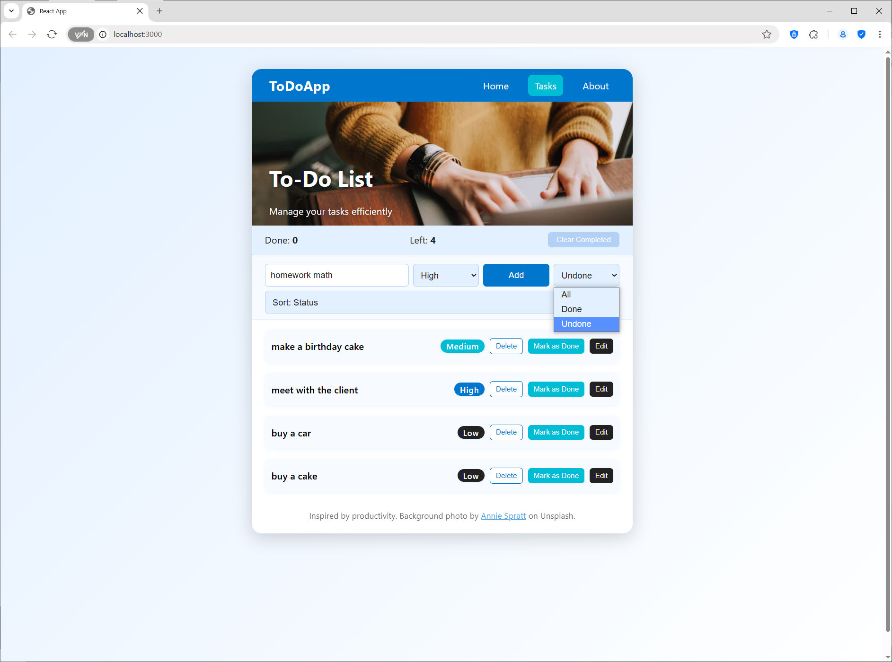
  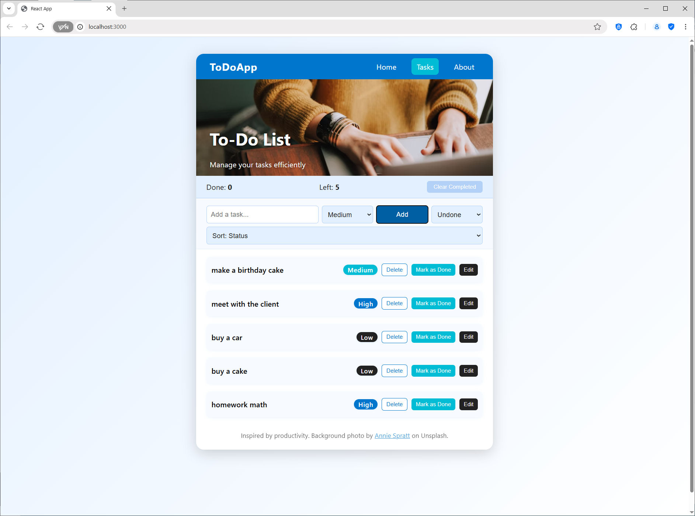
  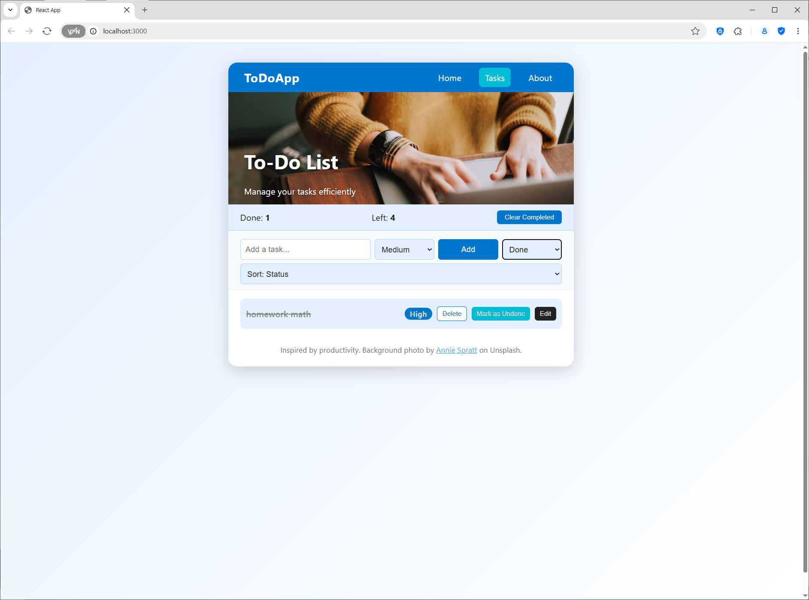
  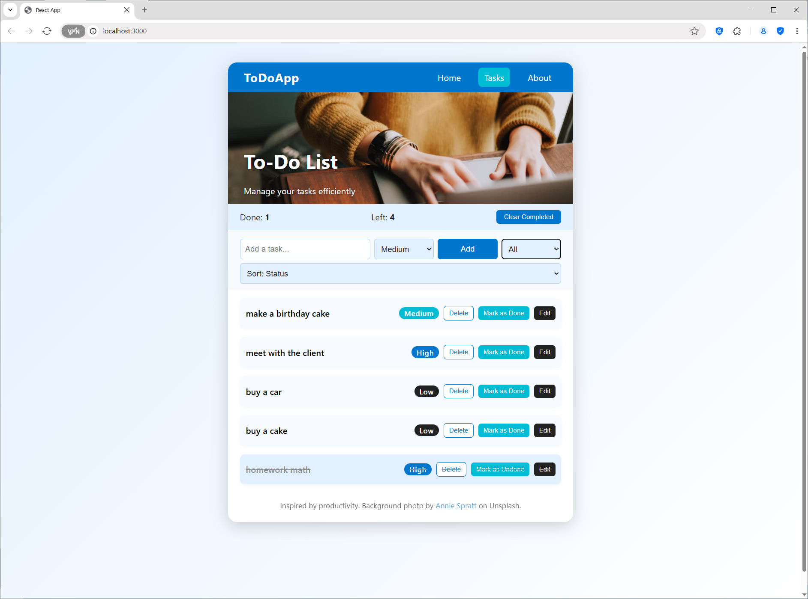
  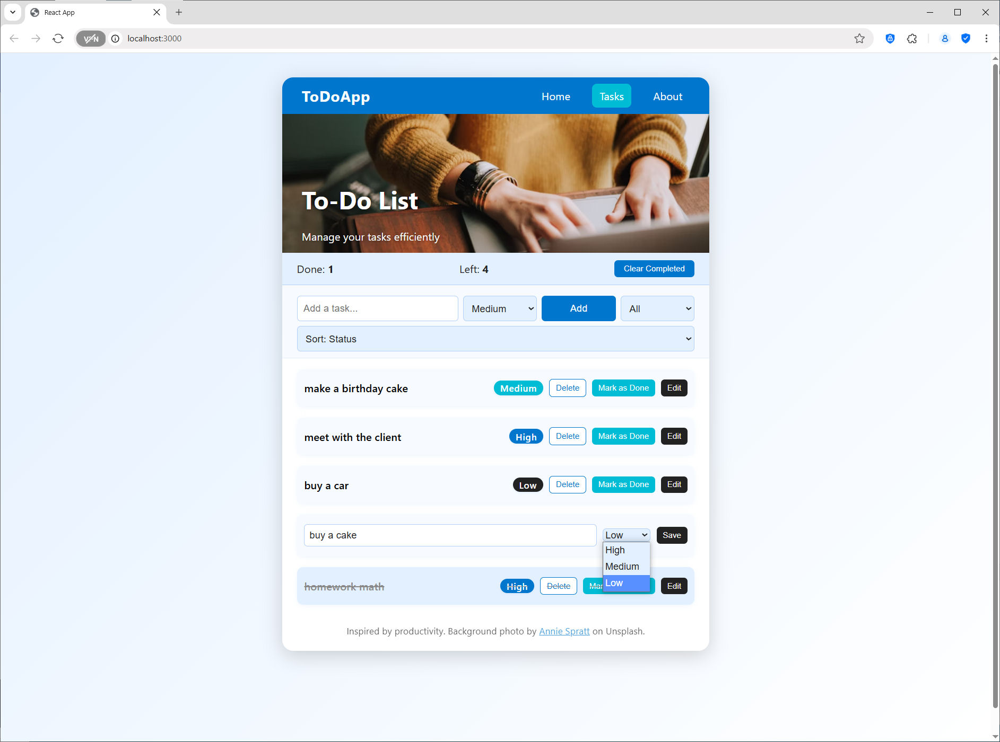
  
  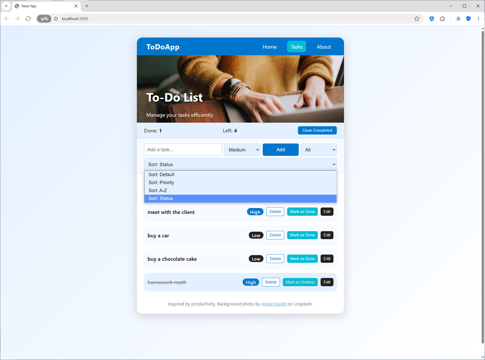
  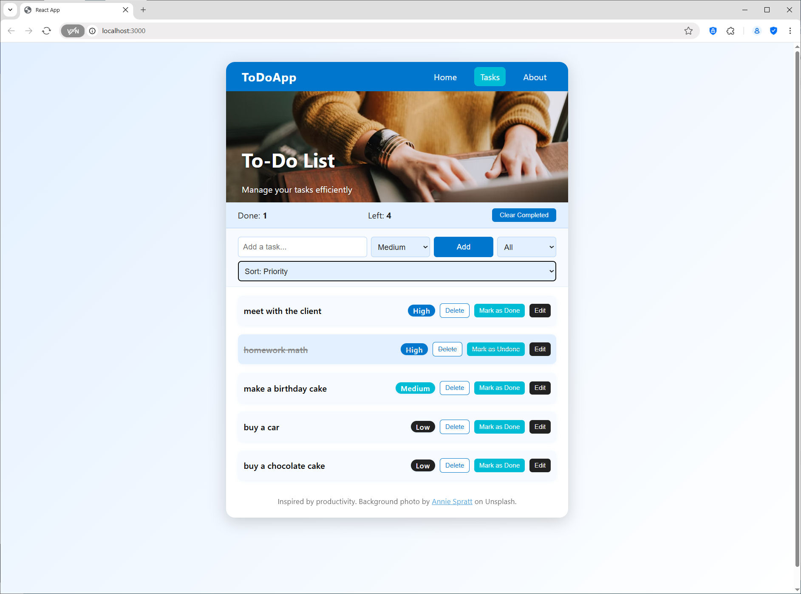
  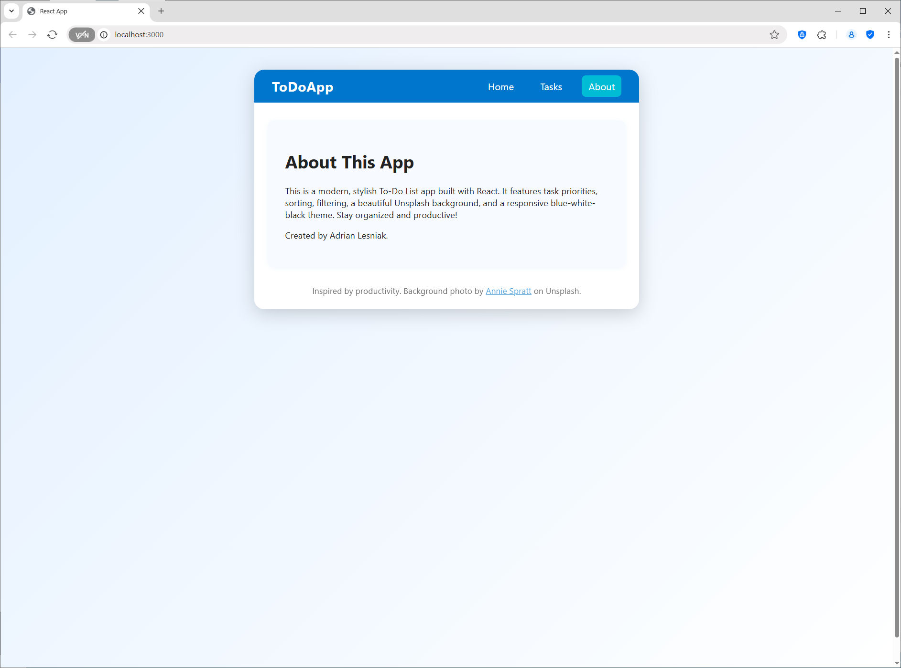
</p>

## ⚙️ System Requirements

*   **Node.js**: v14 or higher
*   **npm**: v6 or higher
*   **Modern Web Browser**: Chrome, Firefox, Edge, Safari
*   **Internet connection** (for Unsplash background)

## 🛠️ Installation and Setup

1.  **Clone or Download the Source Code**:
    ```bash
    git clone <repository-url>
    cd <repository-directory>
    ```
2.  **Install Dependencies**:
    ```bash
    npm install
    ```
3.  **Run the Application**:
    ```bash
    npm start
    ```
    The app will open at [http://localhost:3000](http://localhost:3000)

## 💡 Application Usage

1.  **Navigation**: Use the menu to switch between Home, Tasks, and About.
2.  **Adding Tasks**: Enter a task, select priority, and click Add.
3.  **Editing/Deleting**: Edit or delete tasks using the buttons next to each item.
4.  **Mark as Done/Undone**: Toggle task status with the Mark as Done/Undone button.
5.  **Sorting/Filtering**: Use dropdowns to sort and filter your tasks.
6.  **Clear Completed**: Remove all completed tasks with one click.
7.  **About**: Learn more about the app and author in the About section.

## 🗂️ File Structure (Expected)

*   `src/App.js`: Main React component (UI, logic, navigation)
*   `src/App.css`: Custom styles for the app
*   `src/index.js`: Entry point for React
*   `screenshots/`: Folder with conceptual screenshots and GIFs
*   `README.md`: This documentation file

## 📝 Technical Notes

*   **Data Storage**: All tasks are stored in the browser's localStorage for privacy and offline use.
*   **Responsive Design**: The app works on desktop and mobile browsers.
*   **Unsplash Background**: The header uses a free Unsplash image for a modern look.
*   **No Backend Required**: All logic runs in the browser.

## 🤝 Contributing

Contributions to **React ToDo Pro** are welcome! Ideas for new features, UI improvements, or bug fixes:

1.  Fork the repository.
2.  Create a new branch for your feature (`git checkout -b feature/YourFeature`).
3.  Make your changes.
4.  Commit your changes (`git commit -m 'Feature: Add new feature'`).
5.  Push to the branch (`git push origin feature/YourFeature`).
6.  Open a Pull Request.

Please ensure your code is well-commented and follows good React and JavaScript practices.

## 📃 License

This project is licensed under the **MIT License**.

## 📧 Contact

Application concept by **Adrian Lesniak**.
For questions or feedback, please open an issue on the GitHub repository or contact the repository owner.

---
📅 _Organize your life with React ToDo Pro!_
